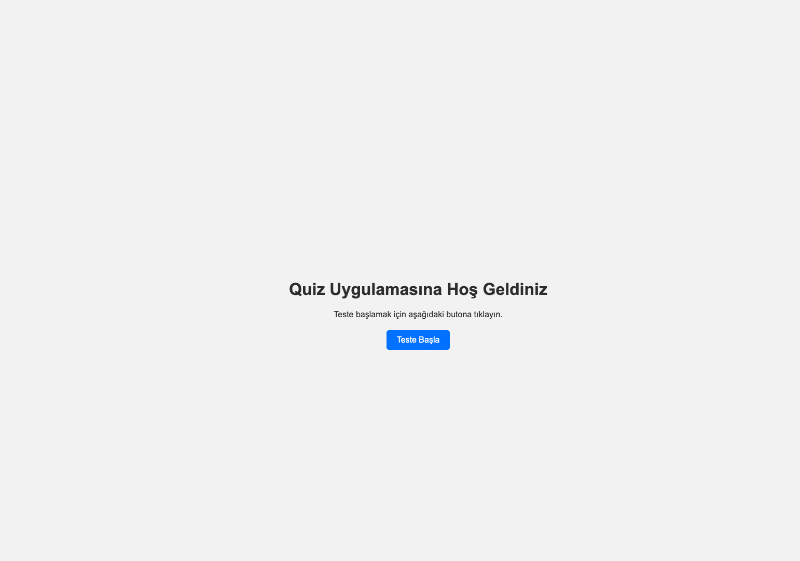
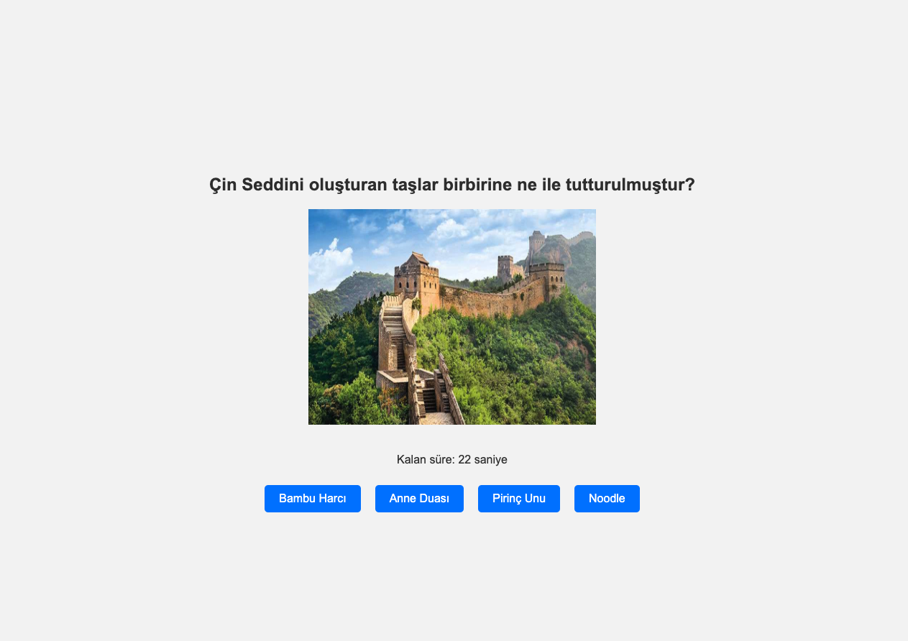
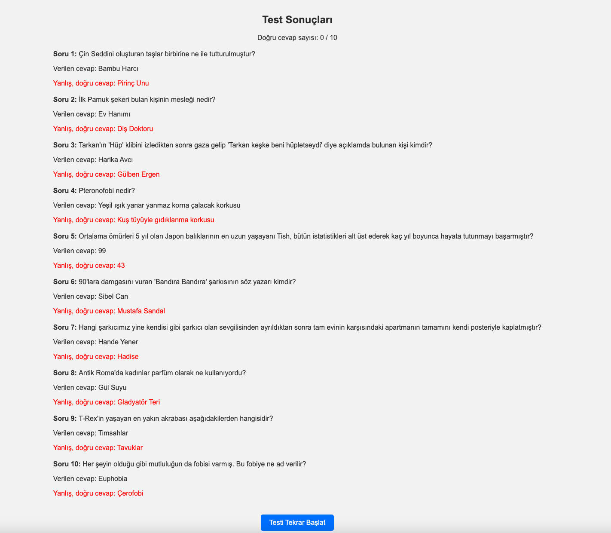

# Quiz Uygulaması

Bu proje, kullanıcıların eğlenceli ve öğretici sorularla dolu bir quiz çözmelerine olanak tanıyan basit bir quiz uygulamasıdır. Uygulama, belirli bir süre boyunca her soruya yanıt verilmesini gerektirir ve sonunda kullanıcıya doğru cevap sayısı gösterilir.

# Project Title

Bu proje, [Netlify](https://serene-marshmallow-837b88.netlify.app) üzerinde canlı olarak yayınlanmıştır. Aşağıdaki bağlantıdan projeyi inceleyebilirsiniz:

[Demo](https://serene-marshmallow-837b88.netlify.app)

## Proje Amacı

Bu uygulama, JavaScript ve React kullanarak bir quiz uygulamasının temel işleyişini öğretmek amacıyla geliştirilmiştir. Kullanıcının zaman yönetimini ve bilgi seviyesini test eden bir eğlence aracıdır.

## Özellikler

- **Zamanlayıcı**: Her soruya 30 saniye yanıt süresi tanır.
- **Geçiş Gecikmesi**: Sorulara seçenekler 4 saniye gecikmeli olarak görünür.
- **Sonuç Ekranı**: Kullanıcının doğru ve yanlış cevaplarını gösteren sonuç ekranı.
- **Test Yenileme**: Kullanıcı testi tekrar çözmek için testi yenileyebilir.

## Kullanılan Teknolojiler

- **React**: Bileşen tabanlı yapı ile kullanıcı arayüzü geliştirildi.
- **JavaScript**: Quiz işleyişini sağlamak için gerekli olan temel fonksiyonlar ve zamanlayıcılar yazıldı.
- **CSS**: Basit bir kullanıcı dostu arayüz tasarımı yapıldı.
- **HTML**: React içinde temel yapılandırmalar için kullanıldı.

## Proje Kurulumu

1. Bu projeyi klonlayın:
    ```bash
    git clone <repository-link>
    ```
2. Proje dizinine gidin:
    ```bash
    cd quiz-uygulamasi
    ```
3. Gerekli paketleri yükleyin:
    ```bash
    npm install
    ```
4. Uygulamayı çalıştırın:
    ```bash
    npm start
    ```

## Dosya Yapısı

- **App.js**: Uygulamanın ana bileşeni.
- **Quiz.js**: Soru-cevap mekanizmasını yöneten bileşen.
- **StartScreen.js**: Kullanıcının testi başlatmasına olanak tanır.
- **ResultScreen.js**: Test sonunda doğru ve yanlış cevapları gösterir.
- **questions.js**: Soruların, seçeneklerin ve cevapların bulunduğu veri dosyası.
- **style.css**: Uygulamanın temel stil dosyası.

## Kullanıcı Rehberi

1. Uygulama başlatıldığında "Teste Başla" butonuna tıklayın.
2. Her bir soru için seçenekler 4 saniye sonra ekrana gelecektir.
3. 30 saniye içinde doğru seçeneği seçin, ardından bir sonraki soruya geçecektir.
4. Tüm sorular tamamlandığında sonuç ekranı görüntülenecektir.
5. İsterseniz "Testi Tekrar Başlat" butonuna tıklayarak tekrar çözebilirsiniz.

## Ekran Görüntüleri

### Başlangıç Ekranı


### Quiz Ekranı


### Sonuç Ekranı


## Geliştiren

**Yakup Eren Ermurat**

---

Proje hakkındaki düşünceleriniz veya önerileriniz için geri bildirimde bulunabilirsiniz!
